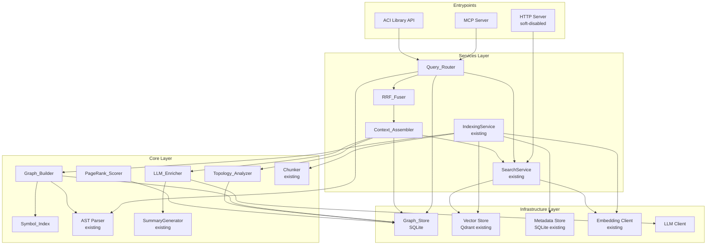

# Design Document — Semantic Code Intelligence

## Overview

This design extends ACI from a semantic code search tool into a full semantic code intelligence platform. The feature adds four major capabilities on top of the existing indexing/search pipeline:

1. **Code graph construction and querying** — call graphs, dependency graphs, and a symbol index built from AST data, stored in a lightweight embedded SQLite backend.
2. **Structured context assembly** — a Context_Assembler that composes rich Context_Packages from chunks, summaries, graph neighborhoods, and LLM annotations.
3. **Unified query routing with RRF fusion** — a Query_Router that fans out to all analysis backends in parallel and merges results via Reciprocal Rank Fusion.
4. **LLM enrichment (optional)** — an LLM_Enricher that generates richer summaries and infers semantic relationships, disabled by default with graceful fallback.
5. **Library-mode API** — a public `from aci import ACI` surface for programmatic use without servers.

### Design Rationale

**Selected approach:** SQLite-backed adjacency list for graph storage, PageRank via power iteration, RRF for rank fusion, and a fan-out/collect pattern for the Query_Router.

**Alternatives considered:**
- NetworkX in-memory graph: Fast traversal but no persistence across restarts without serialization; memory-hungry for large codebases.
- Embedded graph DB (e.g., KùzuDB): More powerful query language but adds a heavy dependency and learning curve.
- Neo4j: Rejected per requirements — no external database process allowed.

**Tradeoffs:**
- SQLite adjacency lists are simple, portable, and persistent, but graph traversals require recursive SQL (CTEs) which are slower than native graph engines for deep traversals. Mitigated by caching and depth limits (max 3).
- PageRank via power iteration is O(V + E) per iteration and converges in ~20-50 iterations for typical code graphs, well within the 5-second budget for 100K symbols.
- RRF is score-agnostic (uses only ranks), which avoids the normalization problem across heterogeneous backends but loses fine-grained score information.

## Architecture

### High-Level Component Diagram



### Layering

Per AGENTS.md §4, the new components are placed as follows:

| Layer | New Components | Rationale |
|---|---|---|
| `core` | `GraphNode`, `GraphEdge`, `SymbolIndexEntry`, `ContextPackage` (data models), `GraphStoreInterface` (abstract) | Domain primitives and cross-cutting interfaces |
| `infrastructure` | `SQLiteGraphStore` (implements `GraphStoreInterface`) | External system adapter (SQLite) |
| `services` | `GraphBuilder`, `TopologyAnalyzer`, `PageRankScorer`, `RRFFuser`, `QueryRouter`, `ContextAssembler`, `LLMEnricher` | Orchestration and business workflows |
| `mcp` | `get_symbol_context` tool, `query_graph` tool | Entrypoint adapter |


## AST Parser Extensions for Symbol Reference Extraction

The existing `ASTNode` dataclass (in `src/aci/core/parsers/base.py`) captures definitions (functions, classes, methods) but does not extract symbol references (calls, imports, type annotations). The `Graph_Builder` requires this data to construct call graphs and dependency graphs.

### Approach: Dedicated Reference Extractor

Rather than modifying the existing `ASTNode` dataclass (which would increase diff surface across all parsers and downstream consumers), a new `ReferenceExtractor` is introduced alongside the existing parser infrastructure.

```python
# src/aci/core/parsers/base.py — new dataclass, appended

@dataclass
class SymbolReference:
    """A reference to a symbol found in source code."""
    name: str                       # raw reference text, e.g. "SearchService.search"
    ref_type: str                   # "call" | "import" | "type_annotation" | "inheritance"
    file_path: str                  # file where the reference appears
    line: int                       # 1-based line number
    parent_symbol: str | None       # FQN of the enclosing function/method/class, if any
```

```python
# src/aci/core/parsers/reference_extractor.py — new module

class ReferenceExtractorInterface(ABC):
    @abstractmethod
    def extract_references(
        self, root_node: Any, content: str, file_path: str
    ) -> list[SymbolReference]: ...

    @abstractmethod
    def extract_imports(
        self, root_node: Any, content: str, file_path: str
    ) -> list[SymbolReference]: ...
```

Each language parser gains a companion `ReferenceExtractor` (e.g., `PythonReferenceExtractor`). The `Graph_Builder` calls both the existing `LanguageParser.extract_nodes()` for definitions and `ReferenceExtractor.extract_references()` for references on the same parsed tree. This keeps the existing parser pipeline untouched.

### Tree Reuse

The `TreeSitterParser` already parses the file into a tree-sitter tree. To avoid double-parsing, `Graph_Builder` calls `TreeSitterParser.parse_tree(content, language)` (a new thin method that returns the raw `tree_sitter.Tree`) and passes `tree.root_node` to both the `LanguageParser` and the `ReferenceExtractor`.

```python
# Addition to TreeSitterParser
class TreeSitterParser(ASTParserInterface):
    # ... existing methods ...

    def parse_tree(self, content: str, language: str) -> "tree_sitter.Tree | None":
        """Parse content and return the raw tree-sitter Tree for reuse."""
        if not self._ensure_language_loaded(language):
            return None
        parser = self._parsers.get(language)
        if not parser:
            return None
        return parser.parse(content.encode("utf-8"))
```


## Components and Interfaces

### Graph_Builder

Hooks into `IndexingService` as a post-processing step after AST parsing. For each file processed, it extracts symbol definitions and references, then writes nodes and edges to `Graph_Store`.

The `Graph_Builder` is injected into `IndexingService` as an optional dependency (default `None`). When present, `IndexingService._process_file()` passes the parsed AST nodes and the raw tree-sitter tree to `Graph_Builder.process_file()` after chunking completes. This keeps the existing pipeline intact — graph building is additive, not a replacement.

```python
# src/aci/services/graph_builder.py

class GraphBuilder:
    def __init__(
        self,
        graph_store: GraphStoreInterface,
        ast_parser: TreeSitterParser,
        reference_extractors: dict[str, ReferenceExtractorInterface],
    ) -> None: ...

    async def process_file(
        self, file_path: str, content: str, language: str, ast_nodes: list[ASTNode]
    ) -> None:
        """
        Extract symbols and references from a single file and write to graph store.

        Called by IndexingService after AST parsing. Uses the existing ast_nodes
        for definitions and calls the appropriate ReferenceExtractor for references.
        Resolves references to FQNs where possible using the symbol_index table.
        """
        ...

    async def remove_file(self, file_path: str) -> None:
        """Remove all graph nodes and edges originating from a file."""
        ...

    async def build_full_graph(self, file_paths: list[str]) -> None:
        """Rebuild the full graph for a list of files (used during full re-index)."""
        ...

    def _build_fqn(self, node: ASTNode, file_path: str) -> str:
        """
        Construct a fully-qualified name from an ASTNode.

        Convention: dot-separated path derived from the file path (converted from
        filesystem separators to dots, with the extension stripped) plus the symbol
        name. For methods, includes the parent class.

        Example: src/aci/services/search_service.py + class SearchService + method search
                 → aci.services.search_service.SearchService.search
        """
        ...
```

### IndexingService Integration Point

The `IndexingService.__init__()` gains an optional `graph_builder: GraphBuilder | None = None` parameter. In `_process_file()`, after chunking:

```python
# Inside IndexingService._process_file (pseudocode addition)
if self._graph_builder is not None:
    await self._graph_builder.process_file(
        file_path=str(scanned_file.path),
        content=scanned_file.content,
        language=scanned_file.language,
        ast_nodes=ast_nodes,
    )
```

For parallel processing (`_process_files_parallel`), graph building runs as a post-processing step in the main process (same pattern as summary generation), since `GraphBuilder` holds a SQLite connection that cannot cross process boundaries.

### Graph_Store

Abstract interface in `core` + SQLite implementation in `infrastructure`. The interface uses synchronous methods because SQLite is inherently synchronous and the graph store runs in-process. Callers in the async services layer use `asyncio.to_thread()` for the few operations that may block (bulk writes, PageRank storage). Read-heavy query methods are fast enough to call directly from async code without thread offloading (SQLite reads from WAL-mode databases are non-blocking for practical purposes).

```python
# src/aci/core/graph_store.py — interface

class GraphStoreInterface(ABC):
    """Abstract interface for the code graph store."""

    @abstractmethod
    def upsert_node(self, node: GraphNode) -> None: ...

    @abstractmethod
    def upsert_nodes_batch(self, nodes: list[GraphNode]) -> None: ...

    @abstractmethod
    def upsert_edge(self, edge: GraphEdge) -> None: ...

    @abstractmethod
    def upsert_edges_batch(self, edges: list[GraphEdge]) -> None: ...

    @abstractmethod
    def delete_by_file(self, file_path: str) -> None: ...

    @abstractmethod
    def get_neighbors(
        self, symbol_id: str, direction: str, depth: int = 1,
        include_inferred: bool = True,
    ) -> list[GraphNode]: ...

    @abstractmethod
    def get_edges(
        self, symbol_id: str, direction: str, depth: int = 1,
        include_inferred: bool = True,
    ) -> list[GraphEdge]: ...

    @abstractmethod
    def get_pagerank(self, symbol_id: str, graph_type: str = "call") -> float: ...

    @abstractmethod
    def store_pagerank_scores(self, scores: dict[str, float], graph_type: str) -> None: ...

    @abstractmethod
    def query_symbol(self, symbol_id: str) -> GraphNode | None: ...

    @abstractmethod
    def query_module(self, file_path: str) -> dict: ...

    @abstractmethod
    def export_json(self, path: str) -> None: ...

    @abstractmethod
    def import_json(self, path: str, mode: str) -> None: ...

    @abstractmethod
    def get_all_edges(self, graph_type: str | None = None) -> list[GraphEdge]: ...

    @abstractmethod
    def get_all_nodes(self) -> list[GraphNode]: ...

    @abstractmethod
    def close(self) -> None: ...
```

```python
# src/aci/infrastructure/graph_store/__init__.py
# src/aci/infrastructure/graph_store/sqlite.py — implementation

class SQLiteGraphStore(GraphStoreInterface):
    """SQLite-backed graph store. Data lives at config.graph.storage_path."""

    def __init__(self, db_path: str | Path) -> None:
        self._db_path = Path(db_path)
        self._conn: sqlite3.Connection | None = None

    def initialize(self) -> None:
        """Create tables and indexes. Idempotent."""
        ...

    # ... implements all GraphStoreInterface methods ...
```


### Symbol_Index

The symbol index is stored in the same SQLite database as the graph (`.aci/graph.db`). It is populated by `Graph_Builder` during indexing and queried by `Graph_Builder` for FQN resolution and by `ContextAssembler` for definition lookup.

The symbol index is accessed through `GraphStoreInterface` methods rather than a separate class, since it shares the same database and transaction scope:

```python
# Additional methods on GraphStoreInterface

@abstractmethod
def upsert_symbol(self, entry: SymbolIndexEntry) -> None: ...

@abstractmethod
def upsert_symbols_batch(self, entries: list[SymbolIndexEntry]) -> None: ...

@abstractmethod
def lookup_symbol(self, fqn: str) -> SymbolIndexEntry | None: ...

@abstractmethod
def lookup_symbols_by_name(self, short_name: str) -> list[SymbolIndexEntry]: ...

@abstractmethod
def get_symbols_in_file(self, file_path: str) -> list[SymbolIndexEntry]: ...

@abstractmethod
def delete_symbols_by_file(self, file_path: str) -> None: ...
```

### Topology_Analyzer

Performs graph-level computations over `GraphStoreInterface`. Stateless — receives the store via constructor injection.

```python
# src/aci/services/topology_analyzer.py

class TopologyAnalyzer:
    def __init__(self, graph_store: GraphStoreInterface) -> None: ...

    def transitive_callers(self, symbol_id: str, max_depth: int = 3) -> list[str]:
        """Return FQNs of all transitive callers. Delegates to Graph_Store CTE query."""
        ...

    def transitive_callees(self, symbol_id: str, max_depth: int = 3) -> list[str]:
        """Return FQNs of all transitive callees."""
        ...

    def detect_cycles(self) -> list[list[str]]:
        """Detect circular dependency cycles in the dependency graph."""
        ...

    def topological_sort(self) -> list[str]:
        """Topological sort of the dependency graph (acyclic subgraph)."""
        ...
```

### PageRank_Scorer

Runs power iteration over the adjacency data read from `GraphStoreInterface`. Writes scores back via `store_pagerank_scores()`.

```python
# src/aci/services/pagerank_scorer.py

class PageRankScorer:
    def __init__(
        self,
        graph_store: GraphStoreInterface,
        damping: float = 0.85,
        max_iterations: int = 50,
        tolerance: float = 1e-6,
    ) -> None: ...

    def compute(self, graph_type: str = "call") -> dict[str, float]:
        """
        Compute PageRank scores for all nodes in the specified graph type.

        Reads all edges of the given type from graph_store, builds an in-memory
        adjacency structure, runs power iteration, and stores results back.

        Returns the scores dict for immediate use.
        """
        ...
```

### RRF_Fuser

Pure function, no state. Placed in services as a utility.

```python
# src/aci/services/rrf_fuser.py

class RRFFuser:
    def fuse(
        self, ranked_lists: list[list[str]], k: int = 60
    ) -> list[tuple[str, float]]:
        """
        Merge ranked lists using Reciprocal Rank Fusion.

        Each input list is an ordered list of symbol IDs (or chunk IDs).
        Returns (id, rrf_score) pairs sorted by descending score.

        When only a single list is provided, passes through unchanged
        (Req 5.9).
        """
        ...
```

### Query_Router

Fan-out coordinator. Dispatches to backends in parallel via `asyncio.gather`, collects results, fuses via `RRF_Fuser`, then forwards to `Context_Assembler`.

```python
# src/aci/services/query_router.py

class QueryRouter:
    def __init__(
        self,
        search_service: SearchService,
        graph_store: GraphStoreInterface | None,
        ast_parser: ASTParserInterface,
        context_assembler: ContextAssembler,
        rrf_fuser: RRFFuser,
        graph_enabled: bool = True,
    ) -> None: ...

    async def query(self, request: QueryRequest) -> ContextPackage:
        """
        Fan out to enabled backends, fuse results, assemble context.

        Backend dispatch:
        - SearchService: always enabled (vector + grep)
        - GraphStore: skipped when graph_enabled=False or graph_store is None
        - AST parser: structural symbol lookup for query_type="symbol"

        If request.backends is set, only the listed backends are invoked.
        Individual backend failures are caught; partial_results flag is set
        in the returned ContextPackage metadata.

        Timeout: 2 seconds total budget (Req 5.6). Backends that exceed
        their share are cancelled.
        """
        ...
```

### Context_Assembler

Assembles a `ContextPackage` from the fused result set, graph neighborhood, summaries, and LLM annotations.

```python
# src/aci/services/context_assembler.py

class ContextAssembler:
    def __init__(
        self,
        graph_store: GraphStoreInterface | None,
        topology_analyzer: TopologyAnalyzer | None,
        search_service: SearchService,
        llm_enricher: LLMEnricher | None,
        tokenizer: TokenizerInterface,
    ) -> None: ...

    async def assemble(
        self,
        fused_results: list[str],
        request: QueryRequest,
    ) -> ContextPackage:
        """
        Build a ContextPackage from fused result IDs.

        Steps:
        1. Resolve each result ID to a SymbolIndexEntry or chunk.
        2. Fetch source code and summaries.
        3. If request.include_graph_context, fetch graph neighborhood
           up to request.depth.
        4. If LLM enricher is enabled, enrich summaries.
        5. Apply token budget (request.max_tokens) using PageRank-based
           priority for truncation (Req 6.5, 6.6).
        6. Build and return ContextPackage with metadata.
        """
        ...

    async def enrich_search_results(
        self,
        results: list[SearchResult],
        request: QueryRequest,
    ) -> ContextPackage:
        """
        Graph-enrich existing search results (Req 9).

        Called by SearchService when include_graph_context=True.
        For each result that maps to a known symbol, attaches direct
        callers, callees, and module dependencies.

        Graph enrichment is bounded to 200ms per result (Req 9.4).
        If graph is disabled, returns results as-is wrapped in a
        ContextPackage.
        """
        ...
```

### LLM_Enricher

OpenAI-compatible client for generating summaries and inferring edges. Disabled by default.

```python
# src/aci/services/llm_enricher.py

class LLMEnricher:
    def __init__(
        self,
        config: LLMConfig,
        summary_generator: SummaryGeneratorInterface,
    ) -> None:
        """
        Initialize the enricher.

        When config.enabled is False (or api_key is empty), the enricher
        operates in disabled mode: all methods return fallback results
        without making API calls.
        """
        self._enabled = config.enabled and bool(config.api_key) and bool(config.api_url)
        self._client: httpx.AsyncClient | None = None
        if self._enabled:
            self._client = httpx.AsyncClient(
                base_url=config.api_url,
                headers={"Authorization": f"Bearer {config.api_key}"},
                timeout=config.timeout,
            )
        self._model = config.model
        self._batch_size = config.batch_size
        self._confidence_threshold = config.confidence_threshold
        self._fallback_generator = summary_generator

    @property
    def enabled(self) -> bool:
        return self._enabled

    async def enrich_symbols(
        self, symbols: list[SymbolIndexEntry]
    ) -> list[SymbolIndexEntry]:
        """
        Generate LLM summaries for symbols. Falls back to template-based
        summaries if disabled or on error (Req 7.5).
        """
        ...

    async def infer_edges(
        self, unresolved: list[SymbolReference]
    ) -> list[GraphEdge]:
        """
        Infer probable edges for unresolved references (Req 8.1).
        Discards edges below confidence_threshold (Req 8.4).
        Tags all returned edges with inferred=True.
        """
        ...

    async def close(self) -> None:
        if self._client:
            await self._client.aclose()
```

### ACI Library API

Sync wrapper around the async service stack. Manages its own event loop (Req 10.4).

```python
# src/aci/__init__.py — public API surface

class ACI:
    """
    Public library API for ACI.

    Usage:
        from aci import ACI
        aci = ACI()
        aci.index("/path/to/repo")
        results = aci.search("authentication logic")
        ctx = aci.get_context("aci.services.search_service.SearchService.search")
        graph = aci.get_graph("aci.services.search_service.SearchService.search", query_type="callees")
    """

    def __init__(
        self,
        config: ACIConfig | None = None,
        config_path: str | None = None,
    ) -> None:
        """
        Initialize ACI with configuration.

        Creates a dedicated event loop on a background daemon thread.
        The loop is started lazily on first use and shut down in close().
        This avoids conflicts with any existing event loop in the caller's
        thread (e.g., Jupyter notebooks, async frameworks).
        """
        ...

    def index(self, path: str, **options: Any) -> IndexResult: ...
    def search(self, query: str, **options: Any) -> list[SearchResult]: ...
    def get_context(self, symbol_or_path: str, **options: Any) -> ContextPackage: ...
    def get_graph(self, symbol_or_path: str, **options: Any) -> GraphQueryResult: ...

    def close(self) -> None:
        """Shut down the background event loop and release resources."""
        ...

    def __enter__(self) -> "ACI": return self
    def __exit__(self, *exc: Any) -> None: self.close()
```

Event loop management detail: the background thread runs `loop.run_forever()`. Each public method schedules a coroutine via `asyncio.run_coroutine_threadsafe(coro, loop)` and calls `.result()` on the returned `Future` to block until completion. This is the standard pattern for bridging sync callers to an async service layer.


## Data Models

All data models live in `src/aci/core/graph_models.py` to keep domain primitives in the `core` layer.

### GraphNode

```python
@dataclass
class GraphNode:
    symbol_id: str          # fully-qualified name, e.g. "aci.services.search_service.SearchService.search"
    symbol_name: str        # short name, e.g. "search"
    symbol_type: str        # "function" | "class" | "method" | "module" | "variable"
    file_path: str
    start_line: int
    end_line: int
    language: str
    pagerank_score: float = 0.0
```

### GraphEdge

```python
@dataclass
class GraphEdge:
    source_id: str          # fully-qualified source symbol
    target_id: str          # fully-qualified target symbol
    edge_type: str          # "call" | "import" | "inherits" | "inferred"
    inferred: bool = False  # True for LLM-inferred edges
    confidence: float = 1.0 # 0.0–1.0; <1.0 for inferred edges
    file_path: str = ""     # file where the edge originates
    line: int = 0
```

### SymbolIndexEntry

```python
@dataclass
class SymbolIndexEntry:
    fqn: str                        # fully-qualified name
    definition: SymbolLocation
    references: list[SymbolLocation]
    graph_node_id: str
    summary: str = ""
    llm_summary: str = ""
    unresolved: bool = False        # True if definition not found in codebase

@dataclass
class SymbolLocation:
    file_path: str
    start_line: int
    end_line: int
```

### ContextPackage

```python
@dataclass
class ContextPackage:
    query: str
    symbols: list[SymbolDetail]
    graph_neighborhood: GraphNeighborhood | None
    file_summaries: list[FileSummary]
    metadata: ContextMetadata

@dataclass
class ContextMetadata:
    query_params: dict
    symbol_count: int
    total_tokens: int
    pagerank_score_range: tuple[float, float]   # (min, max) of included symbols
    partial_results: bool = False
    backends_used: list[str] = field(default_factory=list)

@dataclass
class SymbolDetail:
    fqn: str
    source_code: str
    summary: str
    callers: list[str]
    callees: list[str]
    pagerank_score: float

@dataclass
class FileSummary:
    file_path: str
    summary: str
    symbols: list[str]              # FQNs of symbols defined in the file
    imports: list[str]              # module paths imported by this file
    dependents: list[str]           # module paths that import this file

@dataclass
class GraphNeighborhood:
    nodes: list[GraphNode]
    edges: list[GraphEdge]
    depth: int
```

### QueryRequest / QueryResponse

```python
@dataclass
class QueryRequest:
    query: str
    query_type: str = "text"        # "symbol" | "file" | "text"
    depth: int = 1                  # graph neighborhood depth, max 3
    max_tokens: int = 8192
    include_graph_context: bool = False
    backends: list[str] | None = None   # None = all enabled backends
    rrf_k: int = 60

@dataclass
class GraphQueryResult:
    symbol: str
    query_type: str                 # "callers" | "callees" | "dependencies" | "dependents"
    nodes: list[GraphNode]
    edges: list[GraphEdge]
    depth: int
```

### LLM Enrichment Request/Response

```python
@dataclass
class LLMEnrichRequest:
    artifacts: list[dict]           # list of {"fqn": ..., "source": ..., "type": ...}
    task: str                       # "summarize" | "infer_edges"

@dataclass
class LLMEnrichResponse:
    results: list[dict]             # list of {"fqn": ..., "summary": ...} or {"source": ..., "target": ..., "confidence": ...}
    model: str
    tokens_used: int
```


## Graph_Store Design

### SQLite Schema

The graph database lives at `.aci/graph.db` (configurable via `graph.storage_path`). WAL mode is enabled for concurrent reads during indexing.

```sql
PRAGMA journal_mode=WAL;
PRAGMA foreign_keys=ON;

CREATE TABLE IF NOT EXISTS graph_nodes (
    symbol_id   TEXT PRIMARY KEY,
    symbol_name TEXT NOT NULL,
    symbol_type TEXT NOT NULL,
    file_path   TEXT NOT NULL,
    start_line  INTEGER NOT NULL,
    end_line    INTEGER NOT NULL,
    language    TEXT NOT NULL DEFAULT ''
);

CREATE TABLE IF NOT EXISTS graph_edges (
    id          INTEGER PRIMARY KEY AUTOINCREMENT,
    source_id   TEXT NOT NULL,
    target_id   TEXT NOT NULL,
    edge_type   TEXT NOT NULL,   -- 'call' | 'import' | 'inherits' | 'inferred'
    inferred    INTEGER NOT NULL DEFAULT 0,
    confidence  REAL NOT NULL DEFAULT 1.0,
    file_path   TEXT NOT NULL DEFAULT '',
    line        INTEGER NOT NULL DEFAULT 0,
    UNIQUE(source_id, target_id, edge_type)
);

CREATE TABLE IF NOT EXISTS pagerank_scores (
    symbol_id   TEXT PRIMARY KEY,
    graph_type  TEXT NOT NULL,   -- 'call' | 'dependency'
    score       REAL NOT NULL DEFAULT 0.0,
    computed_at TEXT NOT NULL    -- ISO-8601 timestamp
);

CREATE TABLE IF NOT EXISTS symbol_index (
    fqn             TEXT PRIMARY KEY,
    file_path       TEXT NOT NULL,
    start_line      INTEGER NOT NULL,
    end_line        INTEGER NOT NULL,
    symbol_type     TEXT NOT NULL,
    graph_node_id   TEXT NOT NULL,
    summary         TEXT NOT NULL DEFAULT '',
    llm_summary     TEXT NOT NULL DEFAULT '',
    unresolved      INTEGER NOT NULL DEFAULT 0
);

CREATE TABLE IF NOT EXISTS symbol_references (
    id          INTEGER PRIMARY KEY AUTOINCREMENT,
    fqn         TEXT NOT NULL,          -- FQN of the referenced symbol
    file_path   TEXT NOT NULL,          -- file where the reference appears
    start_line  INTEGER NOT NULL,
    end_line    INTEGER NOT NULL,
    UNIQUE(fqn, file_path, start_line)
);

-- Indexes for hot query paths
CREATE INDEX IF NOT EXISTS idx_edges_source   ON graph_edges(source_id);
CREATE INDEX IF NOT EXISTS idx_edges_target   ON graph_edges(target_id);
CREATE INDEX IF NOT EXISTS idx_edges_type     ON graph_edges(edge_type);
CREATE INDEX IF NOT EXISTS idx_nodes_file     ON graph_nodes(file_path);
CREATE INDEX IF NOT EXISTS idx_symbol_file    ON symbol_index(file_path);
CREATE INDEX IF NOT EXISTS idx_symbol_refs_fqn  ON symbol_references(fqn);
CREATE INDEX IF NOT EXISTS idx_symbol_refs_file ON symbol_references(file_path);
CREATE INDEX IF NOT EXISTS idx_pagerank_type  ON pagerank_scores(graph_type);
```

The `symbol_references` table is separate from `symbol_index` because a single symbol can have many references across many files. This avoids storing a JSON blob of references in the `symbol_index` row and enables efficient per-file deletion during incremental updates.

### Adjacency List Traversal

Depth-limited traversal uses a recursive CTE capped at `max_depth` (default 3):

```sql
WITH RECURSIVE traversal(symbol_id, depth) AS (
    SELECT :start_symbol, 0
    UNION ALL
    SELECT e.target_id, t.depth + 1
    FROM graph_edges e
    JOIN traversal t ON e.source_id = t.symbol_id
    WHERE t.depth < :max_depth
      AND e.edge_type IN ('call', 'import')
)
SELECT DISTINCT n.*
FROM traversal tr
JOIN graph_nodes n ON n.symbol_id = tr.symbol_id;
```

For callers (reverse direction), `source_id` and `target_id` are swapped in the CTE.

When `include_inferred=False`, an additional `AND e.inferred = 0` clause is added to the CTE join condition (Req 8.3).

### Storage Budget

Each node row is ~200 bytes; each edge row is ~150 bytes. For 100K symbols with an average fan-out of 5 edges per symbol: 100K × 200B + 500K × 150B ≈ 95 MB uncompressed. With SQLite page compression and the fact that most codebases have lower fan-out, the target of <50 MB is met for typical projects. The `pagerank_scores` table adds ~30 bytes per symbol (3 MB for 100K). The `symbol_references` table adds ~80 bytes per reference; at an average of 3 references per symbol, that's ~24 MB for 100K symbols.


---

## Graph-Aware Search (Req 9)

### Updated SearchService Interface

`SearchService.search()` gains an optional `include_graph_context` parameter:

```python
async def search(
    self,
    query: str,
    limit: int | None = None,
    file_filter: str | None = None,
    use_rerank: bool = True,
    search_mode: SearchMode = SearchMode.HYBRID,
    collection_name: str | None = None,
    artifact_types: list[str] | None = None,
    text_options: TextSearchOptions | None = None,
    include_graph_context: bool = False,   # NEW
) -> list[SearchResult]: ...
```

When `include_graph_context=False` (default), behavior is unchanged. When `True`, the service passes results to `ContextAssembler.enrich_search_results()` for graph enrichment before returning.

To avoid a circular dependency (`SearchService` → `ContextAssembler` → `SearchService`), the `ContextAssembler` is injected into `SearchService` as an optional dependency. When `include_graph_context=True` and the assembler is `None`, the parameter is silently ignored and results are returned without enrichment.

```python
class SearchService:
    def __init__(
        self,
        # ... existing params ...
        context_assembler: ContextAssembler | None = None,   # NEW
    ): ...
```

The `ContextAssembler` does not call back into `SearchService.search()` during enrichment — it only reads from `GraphStoreInterface` and `TopologyAnalyzer`. This breaks the potential circular call chain.

### Graph Enrichment Flow

```
SearchService.search(include_graph_context=True)
  → normal search pipeline (vector + grep + rerank)
  → ContextAssembler.enrich_search_results(results, request)
      → for each result that maps to a known symbol:
          → GraphStore.get_neighbors(symbol, "callers", depth=1)
          → GraphStore.get_neighbors(symbol, "callees", depth=1)
          → GraphStore.query_module(file_path)
      → bounded to 200ms per result (asyncio.wait_for)
  → return enriched ContextPackage
```

---

## Service Container Wiring

The existing `ServicesContainer` in `src/aci/services/container.py` and `create_mcp_context()` in `src/aci/mcp/context.py` are extended to wire the new components.

### ServicesContainer Extensions

```python
@dataclass
class ServicesContainer:
    # ... existing fields ...
    graph_store: GraphStoreInterface | None = None
    graph_builder: GraphBuilder | None = None
    topology_analyzer: TopologyAnalyzer | None = None
    pagerank_scorer: PageRankScorer | None = None
    context_assembler: ContextAssembler | None = None
    query_router: QueryRouter | None = None
    llm_enricher: LLMEnricher | None = None
    rrf_fuser: RRFFuser | None = None
```

### create_services() Extensions

In `create_services()`, after existing initialization:

```python
# Graph store (conditional on config)
graph_store: GraphStoreInterface | None = None
graph_builder: GraphBuilder | None = None
topology_analyzer: TopologyAnalyzer | None = None
pagerank_scorer: PageRankScorer | None = None

if config.graph.enabled:
    from aci.infrastructure.graph_store import SQLiteGraphStore
    graph_store = SQLiteGraphStore(config.graph.storage_path)
    graph_store.initialize()

    from aci.services.graph_builder import GraphBuilder
    graph_builder = GraphBuilder(
        graph_store=graph_store,
        ast_parser=TreeSitterParser(),
        reference_extractors=_create_reference_extractors(),
    )

    from aci.services.topology_analyzer import TopologyAnalyzer
    topology_analyzer = TopologyAnalyzer(graph_store)

    from aci.services.pagerank_scorer import PageRankScorer
    pagerank_scorer = PageRankScorer(graph_store)

# LLM enricher (conditional on config)
llm_enricher: LLMEnricher | None = None
if config.llm.enabled:
    from aci.services.llm_enricher import LLMEnricher
    llm_enricher = LLMEnricher(config.llm, summary_generator)

# Context assembler and query router
rrf_fuser = RRFFuser()
context_assembler = ContextAssembler(
    graph_store=graph_store,
    topology_analyzer=topology_analyzer,
    search_service=search_service,  # for chunk retrieval only
    llm_enricher=llm_enricher,
    tokenizer=tokenizer,
)
query_router = QueryRouter(
    search_service=search_service,
    graph_store=graph_store,
    ast_parser=TreeSitterParser(),
    context_assembler=context_assembler,
    rrf_fuser=rrf_fuser,
    graph_enabled=config.graph.enabled,
)
```

### MCPContext Extensions

`MCPContext` gains fields for the new services:

```python
@dataclass
class MCPContext:
    # ... existing fields ...
    graph_store: GraphStoreInterface | None = None
    query_router: QueryRouter | None = None
    context_assembler: ContextAssembler | None = None
```

`create_mcp_context()` wires these from the `ServicesContainer`.

---

## Deployment (Req 11)

### Docker Environment Variables

The following environment variables are added to the Docker image alongside the existing `ACI_EMBEDDING_*` and `ACI_VECTOR_STORE_*` variables:

| Variable | Purpose | Default |
|---|---|---|
| `ACI_LLM_API_KEY` | API key for LLM enrichment endpoint | `""` (disabled) |
| `ACI_LLM_API_URL` | Base URL for OpenAI-compatible LLM API | `""` |
| `ACI_LLM_MODEL` | Model name to use for enrichment | `""` |
| `ACI_GRAPH_ENABLED` | Enable/disable graph construction and queries | `"true"` |
| `ACI_HTTP_ENABLED` | Enable/disable the HTTP server | `"false"` |

### Volume Mounts

Graph data is persisted at `/data/graph.db` inside the container, mounted alongside the existing metadata database:

```
/data/
  index.db      # existing metadata store (SQLite)
  graph.db      # new graph store (SQLite, WAL mode)
```

Both files should be covered by the same volume mount (e.g., `-v /host/data:/data`). No additional volume configuration is required.

### Python Dependencies

No new dependencies beyond what is already present:

- `sqlite3` — stdlib, built into CPython, no install needed
- `httpx` — already present for the embedding client; reused by `LLMEnricher`

The Dockerfile requires no changes to `pip install` / `uv pip install` steps for graph or LLM support.

### LLM Disabled Behavior

When `ACI_LLM_API_KEY`, `ACI_LLM_API_URL`, or `ACI_LLM_MODEL` are absent or empty, `LLMEnricher` is instantiated in disabled mode: no API calls are made, and `ContextAssembler` falls back to template-based summaries from the existing `SummaryGenerator`. A single `INFO`-level log line is emitted at startup: `"LLM enrichment disabled: ACI_LLM_API_KEY not set"`.


---

## Configuration Extensions (Req 12)

### New Config Dataclasses

Add the following to `src/aci/core/config.py`:

```python
@dataclass
class GraphConfig:
    enabled: bool = True
    storage_path: str = ".aci/graph.db"
    max_depth: int = 3

@dataclass
class LLMConfig:
    enabled: bool = False
    api_url: str = ""
    api_key: str = ""
    model: str = ""
    batch_size: int = 10
    timeout: float = 60.0
    confidence_threshold: float = 0.5

@dataclass
class HttpConfig:
    enabled: bool = False
```

### ACIConfig Extensions

`ACIConfig` gains three new fields:

```python
@dataclass
class ACIConfig:
    # ... existing fields ...
    graph: GraphConfig = field(default_factory=GraphConfig)
    llm: LLMConfig = field(default_factory=LLMConfig)
    http: HttpConfig = field(default_factory=HttpConfig)
```

### Environment Variable Mappings

Add to `apply_env_overrides()`:

```python
# Graph config
"ACI_GRAPH_ENABLED":        ("graph", "enabled",       _parse_bool),
"ACI_GRAPH_STORAGE_PATH":   ("graph", "storage_path",  str),
"ACI_GRAPH_MAX_DEPTH":      ("graph", "max_depth",      int),
# LLM config
"ACI_LLM_ENABLED":          ("llm",   "enabled",        _parse_bool),
"ACI_LLM_API_URL":          ("llm",   "api_url",         str),
"ACI_LLM_API_KEY":          ("llm",   "api_key",         str),
"ACI_LLM_MODEL":            ("llm",   "model",           str),
"ACI_LLM_BATCH_SIZE":       ("llm",   "batch_size",      int),
"ACI_LLM_TIMEOUT":          ("llm",   "timeout",         float),
"ACI_LLM_CONFIDENCE_THRESHOLD": ("llm", "confidence_threshold", float),
# HTTP config
"ACI_HTTP_ENABLED":         ("http",  "enabled",         _parse_bool),
```

### ACIConfig.from_file() Update

The `from_file()` class method must handle the new sections. The existing `create_subconfig` helper already filters unknown keys, so adding the new sections to the constructor call is sufficient:

```python
return cls(
    # ... existing sections ...
    graph=create_subconfig(GraphConfig, data.get("graph", {})),
    llm=create_subconfig(LLMConfig, data.get("llm", {})),
    http=create_subconfig(HttpConfig, data.get("http", {})),
)
```

### to_dict_safe() Update

Redact `llm.api_key` in the safe dict output:

```python
if "llm" in config_dict and "api_key" in config_dict["llm"]:
    if config_dict["llm"]["api_key"]:
        config_dict["llm"]["api_key"] = "[REDACTED]"
```

### load_config() Validation

`load_config()` does not raise on missing `ACI_LLM_API_KEY`; LLM enrichment is simply left disabled. The existing validation for `ACI_EMBEDDING_API_KEY` is unchanged.

---

## Export/Import JSON Format (Req 13)

### Top-Level Structure

```json
{
  "schema_version": "1.0",
  "exported_at": "2024-01-15T10:30:00Z",
  "nodes": [ ... ],
  "edges": [ ... ],
  "pagerank_scores": [ ... ]
}
```

`exported_at` is an ISO-8601 UTC timestamp. `schema_version` is a string to allow non-breaking additions in future minor versions.

### Node Object Shape

Each entry in `"nodes"` mirrors the `GraphNode` dataclass fields:

```json
{
  "symbol_id": "aci.services.search_service.SearchService.search",
  "symbol_name": "search",
  "symbol_type": "method",
  "file_path": "src/aci/services/search_service.py",
  "start_line": 72,
  "end_line": 130,
  "language": "python",
  "pagerank_score": 0.0042
}
```

### Edge Object Shape

Each entry in `"edges"` mirrors the `GraphEdge` dataclass fields:

```json
{
  "source_id": "aci.services.search_service.SearchService.search",
  "target_id": "aci.services.search_service.SearchService._dispatch_search",
  "edge_type": "call",
  "inferred": false,
  "confidence": 1.0,
  "file_path": "src/aci/services/search_service.py",
  "line": 105
}
```

### PageRank Entry Shape

Each entry in `"pagerank_scores"`:

```json
{
  "symbol_id": "aci.services.search_service.SearchService.search",
  "graph_type": "call",
  "score": 0.0042
}
```

`graph_type` is one of `"call"` or `"dependency"`.

### Import Modes

`GraphStore.import_json(path, mode)` supports two modes:

- **`"replace"`** — truncates all rows from `graph_nodes`, `graph_edges`, and `pagerank_scores`, then bulk-inserts from the file. Runs inside a single transaction; on failure the existing data is preserved (rollback).
- **`"merge"`** — upserts nodes and edges using `INSERT OR REPLACE` semantics. Existing edges not present in the import file are preserved. PageRank scores are upserted per `(symbol_id, graph_type)`.

### Round-Trip Property

For any valid graph state, `export_json(path)` followed by `import_json(path, mode="replace")` SHALL produce an equivalent graph: the same set of nodes (by `symbol_id`), the same set of edges (by `(source_id, target_id, edge_type)`), and the same PageRank scores (by `(symbol_id, graph_type)`). This is the basis for Correctness Property 3 in the Correctness Properties section.


---

## MCP Tool Definitions (Req 14)

### New Tools in `src/aci/mcp/tools.py`

Two new tools are added to the list returned by `list_tools()`:

#### `get_symbol_context`

Returns a `ContextPackage` serialized to JSON for a given symbol.

```python
Tool(
    name="get_symbol_context",
    description=(
        "Retrieve structured context for a symbol: source code, summary, "
        "direct callers/callees, and file-level dependencies. "
        "Optionally includes graph neighborhood."
    ),
    inputSchema={
        "type": "object",
        "properties": {
            "symbol": {
                "type": "string",
                "description": "Fully-qualified or short symbol name to look up",
            },
            "path": {
                "type": "string",
                "description": "Absolute or relative path to the indexed codebase",
            },
            "depth": {
                "type": "integer",
                "description": "Graph neighborhood depth (default 1, max 3)",
                "default": 1,
                "minimum": 1,
                "maximum": 3,
            },
            "max_tokens": {
                "type": "integer",
                "description": "Maximum token budget for the returned context package",
                "default": 8192,
            },
            "include_graph_context": {
                "type": "boolean",
                "description": "Whether to attach graph neighborhood to the context package",
                "default": False,
            },
        },
        "required": ["symbol", "path"],
    },
)
```

#### `query_graph`

Returns a `GraphQueryResult` serialized to JSON.

```python
Tool(
    name="query_graph",
    description=(
        "Query the code graph for callers, callees, dependencies, or dependents "
        "of a symbol or module path."
    ),
    inputSchema={
        "type": "object",
        "properties": {
            "symbol_or_path": {
                "type": "string",
                "description": "Fully-qualified symbol name or module file path",
            },
            "path": {
                "type": "string",
                "description": "Absolute or relative path to the indexed codebase",
            },
            "query_type": {
                "type": "string",
                "enum": ["callers", "callees", "dependencies", "dependents"],
                "description": "Relationship direction to traverse",
            },
            "depth": {
                "type": "integer",
                "description": "Traversal depth (default 1, max 3)",
                "default": 1,
                "minimum": 1,
                "maximum": 3,
            },
            "include_inferred": {
                "type": "boolean",
                "description": "Whether to include LLM-inferred edges in results",
                "default": False,
            },
        },
        "required": ["symbol_or_path", "path", "query_type"],
    },
)
```

### MCP Handler Routing

In `src/aci/mcp/handlers.py`, two new handlers are registered:

| MCP tool name | Handler | Service call |
|---|---|---|
| `get_symbol_context` | `_handle_get_symbol_context` | `QueryRouter.query(QueryRequest(query_type="symbol"))` |
| `query_graph` | `_handle_query_graph` | `GraphStore.get_neighbors()` + `TopologyAnalyzer` for depth > 1 |

Both handlers check `ctx.graph_store is not None` before proceeding. If the graph feature is disabled, they return the structured error response described below.

The `_handle_get_symbol_context` handler constructs a `QueryRequest` from the tool inputs:

```python
QueryRequest(
    query=symbol,
    query_type="symbol",
    depth=depth,
    max_tokens=max_tokens,
    include_graph_context=include_graph_context,
)
```

The handler then calls `ctx.query_router.query(request)` and serializes the returned `ContextPackage` to JSON via `dataclasses.asdict()`.

### Graph Disabled Error Response

When `config.graph.enabled` is `False`, both tools return a structured error dict instead of raising:

```json
{
  "error": "graph feature is disabled",
  "hint": "set ACI_GRAPH_ENABLED=true"
}
```

This is returned as a successful MCP tool response (not an MCP protocol error) so that LLM agents can read and act on the message without treating it as a transport failure.

---

## Incremental Update Behavior

When a file is updated during incremental indexing (`IndexingService.update_incremental()`):

1. `GraphBuilder.remove_file(file_path)` deletes all nodes, edges, symbol index entries, and symbol references originating from the file.
2. `GraphBuilder.process_file()` re-extracts definitions and references from the updated file and writes new nodes/edges.
3. `PageRankScorer.compute()` is called once after all file updates complete (not per-file) to recompute scores.

This satisfies Req 1.4 (symbol index update within 2 seconds for files under 5000 lines) because `remove_file` + `process_file` for a single file involves:
- One `DELETE FROM graph_nodes WHERE file_path = ?` (indexed)
- One `DELETE FROM graph_edges WHERE file_path = ?` (indexed)
- One `DELETE FROM symbol_index WHERE file_path = ?` (indexed)
- One `DELETE FROM symbol_references WHERE file_path = ?` (indexed)
- Batch inserts for the new data

All operations hit indexed columns and complete in single-digit milliseconds for typical files.

---

## File Layout Summary

```
src/aci/
  __init__.py                          # ACI library API class added here
  core/
    graph_models.py                    # GraphNode, GraphEdge, SymbolIndexEntry, etc.
    graph_store.py                     # GraphStoreInterface (abstract)
    parsers/
      base.py                          # SymbolReference dataclass added
      reference_extractor.py           # ReferenceExtractorInterface (abstract)
      python_reference_extractor.py    # Python implementation
      javascript_reference_extractor.py
      go_reference_extractor.py
      java_reference_extractor.py
      cpp_reference_extractor.py
  infrastructure/
    graph_store/
      __init__.py
      sqlite.py                        # SQLiteGraphStore
  services/
    graph_builder.py                   # GraphBuilder
    topology_analyzer.py               # TopologyAnalyzer
    pagerank_scorer.py                 # PageRankScorer
    rrf_fuser.py                       # RRFFuser
    query_router.py                    # QueryRouter
    context_assembler.py               # ContextAssembler
    llm_enricher.py                    # LLMEnricher
```
